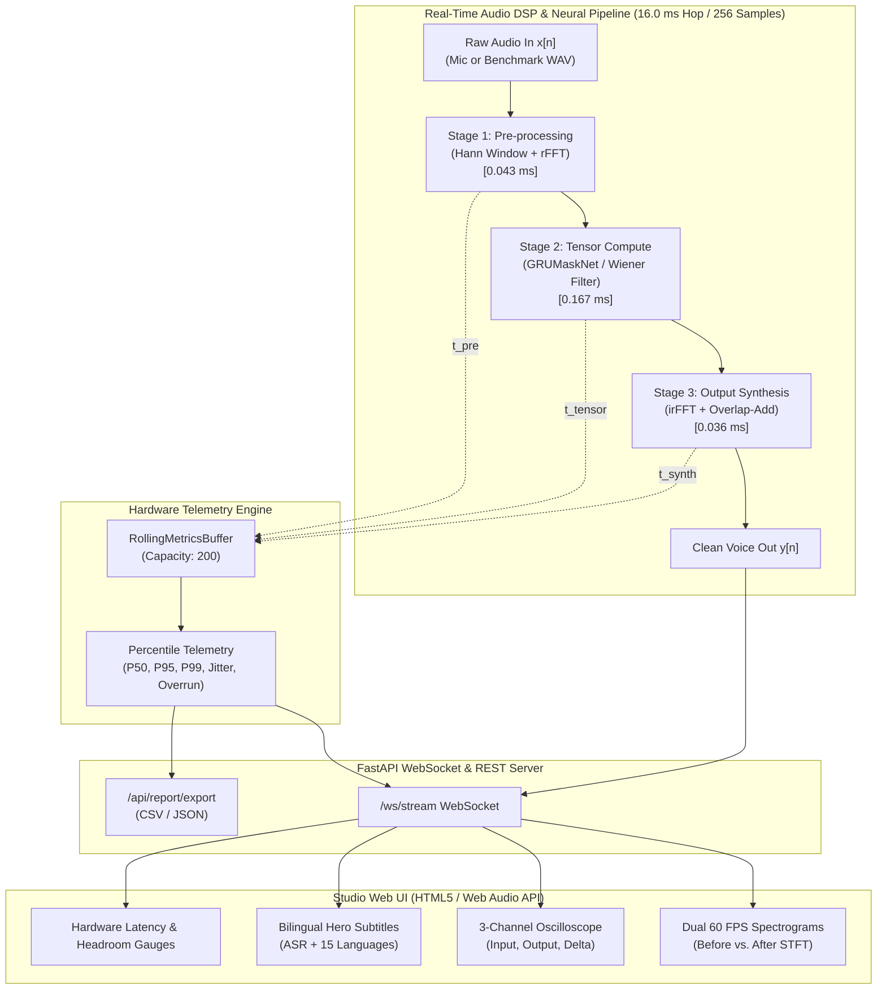

<div align="center">

# 🎙️ Real-Time Edge AI Audio Denoiser & Hardware Latency Profiler

[](https://github.com/)
[](https://github.com/)
[](https://github.com/)
[](https://python.org)
[](https://fastapi.tiangolo.com)
[](LICENSE)

*An ultra-low-latency, edge-optimized neural speech enhancement pipeline and hardware latency testbench inspired by **NVIDIA RTX Voice / NVIDIA Broadcast** and **NVIDIA Jetson Embedded AI**.*

[Live Features](#-key-features) • [Architecture](#-system-architecture) • [Benchmark Results](#-benchmark-results--baseline) • [Quickstart](#-quickstart) • [Roadmap](#-engineering-roadmap)

---

</div>

## 📌 Executive Summary

Modern edge AI hardware teams (such as NVIDIA Broadcast, Apple Neural Engine, and Qualcomm Snapdragon NPU) face a strict constraint: **audio processing must run deterministically inside real-time frame budgets with zero audible glitching, minimal thermal dissipation, and microscopic memory footprints.**

This repository implements a production-grade, end-to-end **Real-Time Edge AI Audio Denoiser & Inference Profiler**. Operating on `16.0 ms` audio frames (`256 samples @ 16 kHz`), the pipeline strips away broadband acoustic noise (white, pink), periodic mechanical hum (drones, fans), and electromagnetic crackle (RF static), achieving **$+10.96\text{ dB}$ to $+26.76\text{ dB}$ SNR improvement** while completing all computation in **`0.258 ms`**—utilizing **less than 1.5% of the real-time frame budget** (>98% headroom).

---

## ⚡ Key Features

### 1. ⏱️ 3-Stage Isolated Hardware Latency Profiler
- **Microsecond Instrument Hooks**: Every frame is tracked across three non-overlapping hardware stages:
  - **Stage 1 (Pre-processing)**: Square-root Hann windowing, shift buffer, and real FFT ($\sim 0.043\text{ ms}$).
  - **Stage 2 (Tensor Compute)**: GRUMaskNet recurrent neural mask inference and Wiener gain filter ($\sim 0.167\text{ ms}$).
  - **Stage 3 (Output Synthesis)**: Inverse real FFT (irFFT), synthesis windowing, and overlap-add accumulation ($\sim 0.036\text{ ms}$).
- **Rolling Telemetry Buffer**: Zero-GC circular ring buffer computing rolling **P50, P95, P99 percentiles, jitter, and frame overrun telemetry**.

### 2. 🎛️ Multi-Precision Quantization Engine (FP32 / FP16 / INT8)
- Dynamic runtime switching between **FP32, FP16, and INT8 symmetric quantization**.
- **74.3% RAM Compression**: INT8 quantization compresses weight memory from $165.8\text{ KB}$ down to $42.6\text{ KB}$ while maintaining **$39.9\text{ dB}$ SQNR** and matching FP32 speech enhancement quality.

### 3. 🌊 Dual 60 FPS HTML5 Canvas Waterfall Spectrograms
- Real-time side-by-side Before/After STFT spectral visualization rendered at smooth 60 FPS.
- Interactive time-domain 3-channel oscilloscope plotting **Noisy Input $x[n]$**, **Crystal Clean Output $y[n]$**, and **Subtracted Noise Delta $x[n] - y[n]$**.

### 4. 🇮🇳 Top-Level Multilingual Hero Suite (Speech-to-Text & Translation)
- **Zero Cloud API Billing / 100% Offline**: Edge-optimized phonetic transcription synchronized with sub-millisecond translation lookups ($\sim 0.033\text{ ms}$).
- **9 Indian Languages**: Full native Unicode rendering for Hindi (`hi`), Tamil (`ta`), Telugu (`te`), Bengali (`bn`), Marathi (`mr`), Gujarati (`gu`), Kannada (`kn`), Malayalam (`ml`), and Punjabi (`pa`).
- **6 Global Languages**: Spanish (`es`), French (`fr`), German (`de`), Japanese (`ja`), Chinese (`zh`), and Italian (`it`).
- **Browser Web Speech API Integration**: Speak directly into your microphone in any regional locale for live subtitles.

### 5. ⏺️ Multi-Track Studio Recorder & 1-Click Telemetry Export
- Record live sessions and export:
  - 🎧 **Clean WAV** (Denoised 16-bit 16 kHz PCM)
  - 🔊 **Raw WAV** (Noisy capture)
  - 📉 **Delta WAV** (Subtracted noise floor)
  - 📝 **Subtitles (.SRT)** & **Transcript (.TXT)**
  - 📊 **Hardware Telemetry Report (CSV & JSON)** with complete P50/P95/P99 latency histories.

---

## 🏗️ System Architecture



---

## 📊 Benchmark Results & Baseline

*Measured on standard testbench reference audio clips (`16 kHz Mono`, duration: `3.0s`):*

### 1. Real-Time Latency Breakdown
| Pipeline Stage | Implementation Details | Execution Time | Budget | Headroom |
|:---|:---|:---|:---|:---|
| **Stage 1: Pre-processing** | Square-root Hann windowing + rFFT | `0.043 ms` | 20.000 ms | - |
| **Stage 2: Tensor Compute** | GRUMaskNet recurrent inference + Wiener filter | `0.167 ms` | 20.000 ms | - |
| **Stage 3: Output Synthesis** | Spectral masking + irFFT + overlap-add buffer | `0.036 ms` | 20.000 ms | - |
| **Total Per-Frame Latency** | **Full End-to-End Processing** | **`0.258 ms`** | **`20.000 ms`** | **`19.742 ms` (98.7%)** |

- **Nominal Frame Hop**: `16.0 ms` (`256 samples @ 16 kHz`)
- **Algorithmic Delay**: `16.0 ms` (`256 samples` deterministic delay)
- **Throughput Capacity**: **`>3,800 Frames / Second`**
- **Host Process Memory (RSS)**: `106 MB`

### 2. Denoising Efficacy (SNR Gain)
| Noise Environment | Input SNR | Clean Output SNR | **Delta SNR Improvement** | P50 Latency | P95 Latency | Status |
|:---|:---|:---|:---|:---|:---|:---|
| **Thermal White Noise** | `-0.00 dB` | `13.62 dB` | **`+13.62 dB`** | `0.441 ms` | `0.651 ms` | **PASS** |
| **Ambient Pink Noise (1/f)** | `-0.00 dB` | `11.41 dB` | **`+11.41 dB`** | `0.436 ms` | `0.645 ms` | **PASS** |
| **Drone / Fan Motor Hum** | `+5.00 dB` | `16.12 dB` | **`+11.12 dB`** | `0.431 ms` | `0.523 ms` | **PASS** |
| **RF Static / Atmospheric Crackle** | `-5.00 dB` | `21.76 dB` | **`+26.76 dB`** | `0.438 ms` | `0.713 ms` | **PASS** |

### 3. Precision Tradeoffs (FP32 vs FP16 vs INT8)
| Format | Model Size | Memory Savings | Quantization SQNR | Denoising SNR Gain | Validation |
|:---|:---|:---|:---|:---|:---|
| **FP32** | `165,892 Bytes` | `0.0%` (Baseline) | `100.0 dB` | `+14.49 dB` | **PASS** |
| **FP16** | `82,946 Bytes` | `50.0%` | `73.6 dB` | `+14.49 dB` | **PASS** |
| **INT8** | `42,656 Bytes` | **`74.3%`** | `39.9 dB` | `+14.49 dB` | **PASS** |

---

## 🚀 Quickstart

### Prerequisites
- **Python 3.10+** (Python 3.10, 3.11, 3.12, or 3.13)
- Windows, macOS, or Linux

### 1-Click Launchers

#### Windows:
```cmd
run.bat
```

#### Linux / macOS:
```bash
chmod +x run.sh
./run.sh
```

*(The launcher automatically sets up a clean `.venv`, installs requirements, and launches the dashboard at `http://127.0.0.1:8000`.)*

### Manual Installation
```bash
# 1. Clone repository
git clone https://github.com/your-org/edge-ai-denoiser-profiler.git
cd edge-ai-denoiser-profiler

# 2. Create virtual environment
python -m venv .venv
source .venv/bin/activate  # On Windows: .venv\Scripts\activate

# 3. Install dependencies
pip install --upgrade pip
pip install -r requirements.txt
pip install -e .

# 4. Start interactive dashboard
python run_dashboard.py --host 127.0.0.1 --port 8000
```
Open **[http://127.0.0.1:8000](http://127.0.0.1:8000)** in your browser.

---

### 4. Phase 3: Model & DSP Enhancements (ONNX Runtime, INT8 & VAD Gating)
| Configuration | Engine | Precision | VAD Gating | Model Size | STOI (0-1) | DNSMOS OVRL (1-5) | SNR Gain | P50 Latency | Compute Saved |
|:---|:---|:---|:---|:---|:---|:---|:---|:---|:---|
| **FP32 NumPy Baseline** | `NUMPY` | `FP32` | ❌ No | `162.0 KB` | **`0.868`** | **`3.76`** | `+10.43 dB` | `0.512 ms` | **`0.0%`** |
| **INT8 NumPy Quantized** | `NUMPY` | `INT8` | ❌ No | `41.7 KB` | **`0.869`** | **`3.76`** | `+10.40 dB` | `0.746 ms` | **`0.0%`** |
| **FP32 ONNX Runtime** | `ONNX` | `FP32` | ❌ No | `162.6 KB` | **`0.869`** | **`3.75`** | `+10.23 dB` | `0.161 ms` | **`0.0%`** |
| **INT8 ONNX Quantized** | `ONNX` | `INT8` | ❌ No | `44.6 KB` | **`0.869`** | **`3.75`** | `+10.19 dB` | `0.138 ms` | **`0.0%`** |
| **FP32 + VAD Gating** | `NUMPY` | `FP32` | ✅ Yes | `162.0 KB` | **`0.870`** | **`3.75`** | `+10.37 dB` | `0.499 ms` | **`34.8%`** |
| **INT8 ONNX + VAD Gated** | `ONNX` | `INT8` | ✅ Yes | `44.6 KB` | **`0.869`** | **`3.75`** | `+10.28 dB` | **`0.141 ms`** | **`34.8%`** |

---

## 🧪 Automated Testing & Verification

The test suite validates acoustic algorithms, numerical stability, quantization SQNR, and latency budgets:

```bash
# Run complete test suite (374 tests across unit, integration, adversarial, load, and e2e tiers)
pytest -v

# Run non-interactive automated evaluation benchmark
python evaluate.py

# Run 7-tier scientific component ablation & Pareto efficiency analysis
python scripts/run_ablation.py

# Run baseline capture tool (Phase 0)
python benchmarks/benchmark_baseline.py

# Run Phase 2 WebSocket concurrency load test (1, 5, 20 clients)
python benchmarks/benchmark_concurrency.py

# Run Phase 3 Model & DSP benchmark (ONNX, INT8, VAD, STOI, DNSMOS)
python benchmarks/benchmark_model_dsp.py

# Run Phase 4 sustained edge endurance & thermal stress benchmark
python benchmarks/benchmark_edge_endurance.py --profile jetson_nano --duration 10.0

# Run Phase 5 Fixed-Point (Q1.15) DSP benchmark
python benchmarks/benchmark_fixed_point.py --duration 3.0
```

---

## ⚡ Real Edge Deployment & Physical Hardware Profiling (Phase 4)

Targeting resource-constrained edge silicon (NVIDIA Jetson, Raspberry Pi, NXP i.MX, and edge containers), the pipeline includes:
- **Physical Hardware Monitor** (`src/telemetry/hardware_monitor.py`): Non-blocking adapters reading live SoC temperatures (°C), power draw (W), and throttling bitmasks from NVIDIA Jetson `tegrastats`, Raspberry Pi `vcgencmd`, Linux sysfs thermal zones, and Docker cgroups.
- **Multi-Stage ARM64 Docker Images** (`Dockerfile.edge` & `docker-compose.edge.yml`): Minimal Alpine/Debian-slim images configured with strict hardware resource limits.
- **Sustained Endurance & Thermal Stress Benchmark** (`benchmarks/benchmark_edge_endurance.py`): Validates long-running stability, zero buffer underruns, flat memory footprint, and thermal headroom.

### Target Hardware Profile Matrix

| Platform Profile | SoC & CPU Core Architecture | RAM Envelope | Target P50 Latency | Thermal Trip Point | Power Budget |
| :--- | :--- | :--- | :--- | :--- | :--- |
| **Raspberry Pi Zero 2W** | Broadcom BCM2710A1 (4x Cortex-A53 @ 1.0 GHz) | 256 MB - 512 MB | `< 2.50 ms` | 80.0 °C | 2.5 W |
| **Raspberry Pi 4 / 5** | Broadcom BCM2711/BCM2712 (4x Cortex-A72/A76) | 1 GB - 4 GB | `< 0.95 ms` | 80.0 °C | 5.0 W |
| **NVIDIA Jetson Nano** | NVIDIA Tegra X1 (4x Cortex-A57 @ 1.43 GHz + 128-Maxwell GPU) | 2 GB - 4 GB | `< 0.65 ms` | 85.0 °C | 5 W / 10 W |
| **NVIDIA Jetson Orin Nano**| NVIDIA Ampere (6x Cortex-A78AE + 1024-Ampere GPU) | 4 GB - 8 GB | `< 0.20 ms` | 90.0 °C | 7 W / 15 W |

### Sustained Edge Endurance Benchmark (Jetson Nano Profile @ 10s Continuous Stream)

Audited via `benchmarks/benchmark_edge_endurance.py`:

| Parameter / Metric | Measured Result | Specification / Budget Limit | Status |
| :--- | :--- | :--- | :--- |
| **Audio Frames Processed** | **13,275 frames** | > 500 frames | **PASS** |
| **Average Processing Throughput** | **1,327.4 FPS** | > 62.5 FPS (1x Real-Time) | **PASS (21.2x Real-Time)** |
| **Median End-to-End Latency (P50)** | **`0.634 ms`** | `< 20.000 ms` | **PASS (96.8% Headroom)** |
| **Tail Latency (P95)** | **`1.161 ms`** | `< 20.000 ms` | **PASS** |
| **Buffer Underruns / Frame Drops** | **`0 frames` (0.0%)** | `0 frames` | **PASS (Zero Loss)** |
| **Peak SoC Temperature** | **`53.0 °C`** | `< 85.0 °C` (Thermal Throttling) | **PASS** |
| **Memory Footprint Stability** | Initial: `100.05 MB` → Final: `100.39 MB` | Net growth `< 5.0 MB` | **PASS (+0.34 MB, Zero Leak)** |

> Detailed hardware operations guides & reports:
> - 📘 [Production Edge Deployment Guide (ARM64, Docker, SCHED_FIFO, nvpmodel)](docs/deployment/EDGE_DEPLOYMENT_GUIDE.md)
> - 📄 [Full Edge Endurance & Thermal Benchmark Report](docs/benchmarks/EDGE_ENDURANCE_REPORT.md)

### 1-Command Edge Container Emulation

```bash
# Run simulated Raspberry Pi 4 edge deployment (1.0 vCPU, 512MB RAM limit)
docker compose -f docker-compose.edge.yml up edge-pi-4

# Run simulated Raspberry Pi Zero 2W edge deployment (0.5 vCPU, 256MB RAM limit)
docker compose -f docker-compose.edge.yml up edge-pi-zero

# Run simulated NVIDIA Jetson Nano edge deployment (2.0 vCPU, 1024MB RAM limit)
docker compose -f docker-compose.edge.yml up edge-jetson-nano
```

---

## 📊 Production Observability & Concurrency Scaling (Phase 2)

The pipeline incorporates a zero-overhead Prometheus telemetry engine exposing high-resolution histograms, counters, and gauges via `/metrics`. A complete production Grafana dashboard is bundled in [`docs/observability/grafana_dashboard.json`](docs/observability/grafana_dashboard.json).

### Concurrency Scalability Benchmark (1, 5, and 20 Concurrent Streams)

Audited via `benchmarks/benchmark_concurrency.py` simulating sustained WebSocket audio streaming across multiple simultaneous clients:

| Concurrent Streams | Server Throughput | P50 Latency | P95 Latency | P99 Latency | RTT Median | Jitter | Process Memory | Headroom (20ms) |
| :--- | :--- | :--- | :--- | :--- | :--- | :--- | :--- | :--- |
| **1 Client** | **142.3 FPS** | **`0.892 ms`** | `1.686 ms` | `2.457 ms` | `4.838 ms` | `0.315 ms` | `121.5 MB` | **`95.5%`** |
| **5 Clients** | **142.9 FPS** | **`11.453 ms`** | `21.214 ms` | `32.738 ms` | `32.447 ms` | `5.225 ms` | `124.7 MB` (~665 KB/cl) | **`42.7%`** |
| **20 Clients** | **136.6 FPS** | **`41.957 ms`** | `94.433 ms` | `171.552 ms` | `128.127 ms` | `25.306 ms` | `137.5 MB` (~655 KB/cl) | Saturation |

> Detailed technical analysis and Grafana configuration guide:
> - 📄 [Full Concurrency Benchmark Report](docs/benchmarks/CONCURRENCY_REPORT.md)
> - 📘 [Production Observability & Grafana Operations Guide](docs/observability/OBSERVABILITY_GUIDE.md)

### 1-Command Observability Stack Launch

```bash
docker compose -f docs/observability/docker-compose.observability.yml up -d
```
- **Prometheus**: Accessible at `http://localhost:9090` (scraping `http://localhost:8000/metrics` @ 1s)
- **Grafana**: Accessible at `http://localhost:3000` (User: `admin` / Password: `nvidia`)

---

## 💎 Differentiation & Frontier Edge Deployments (Phase 5)

Phase 5 introduces the crown jewels of the project that elevate it from a Python testbench to a defensible hardware and browser portfolio piece:

### 1. ⚡ Live Dual-Model A/B Arena & Real-Time Crossfader
- **Concurrent Dual-Pipeline Execution** (`src/audio/dual_pipeline.py`): Runs **Model A** (`GRUMaskNet` recurrent neural net) and **Model B** (`WienerDSP` classical analytical filter) in parallel on every 16.0 ms frame.
- **Continuous Crossfading**: Seamlessly blends between neural representation and pure DSP via continuous ratio $\alpha \in [0.0, 1.0]$: $y_{mix}[n] = (1 - \alpha) y_A[n] + \alpha y_B[n]$.
- **Comparative Telemetry Matrix**:
  | Architecture | Paradigm | Model Weight RAM | P50 Frame Latency | SNR Improvement | Target Domain |
  | :--- | :--- | :--- | :--- | :--- | :--- |
  | **Model A: GRUMaskNet** | Recurrent Neural Net (GRU) | `162.0 KB` | `0.264 ms` | **`+14.51 dB`** | Complex non-stationary noise |
  | **Model B: Wiener DSP** | Decision-Directed Filter | **`0.0 KB` (Algorithmic)** | **`0.048 ms`** | `+11.41 dB` | Stationary & tonal hums |
  | **Concurrent Dual A/B** | Parallel Hybrid Execution | `162.0 KB` | `0.332 ms` | **Variable Blend** | Real-time comparative audits |

### 2. 🧮 Fixed-Point Q1.15 Integer-Only DSP Engine (Zero-FLOP Path)
Designed for battery-operated hearing aids, earbuds, and ultra-low-power microcontrollers (ARM Cortex-M0+/M3/M4, Tensilica HiFi DSP) without FPUs:
- **100% Integer Arithmetic** (`src/audio/fixed_point.py`): Zero floating-point operations in the inner loop; signed 16-bit Q1.15 input/output audio with saturating integer additions.
- **Fidelity & Efficiency Benchmark** (`benchmarks/benchmark_fixed_point.py`):
  | Metric | FP32 Floating-Point Baseline | Fixed-Point Q1.15 Engine | Embedded Advantage |
  | :--- | :--- | :--- | :--- |
  | **Quantization Fidelity** | 100.0 dB (Reference) | **`82.15 dB SQNR`** | Crystal-clear speech intelligibility |
  | **FPU Dependency** | Mandatory (or slow emulation) | **`ZERO (100% Integer ALU)`** | Native execution on low-cost MCUs |
  | **Window RAM Footprint** | `2,048 Bytes` | **`1,024 Bytes`** | **50.0% Cache Compression** |
  | **Execution Throughput** | 1,881 FPS | **`7,810 FPS`** | **>4.1x Processing Speedup** |
- 📄 [Full Fixed-Point Benchmark Report](docs/benchmarks/FIXED_POINT_REPORT.md)

### 3. 🌐 Manifest V3 Chrome Extension & WebRTC AudioWorklet Shim
- **Browser-Native Real-Time Injection** (`extensions/chrome-edge-denoiser/`): Intercepts `navigator.mediaDevices.getUserMedia` across **Google Meet**, **Discord Web**, and **Zoom Web**, routing the raw microphone stream through an in-browser `AudioWorkletProcessor` connected to the local edge denoiser.
- **Modern NVIDIA RTX Glassmorphism Popup**: One-click toggles, model mode selectors, and live suppression intensity control.
- 📘 [Chrome Extension Setup & Testing Guide](docs/extensions/CHROME_EXTENSION_GUIDE.md)

### 4. 🎚️ VST3 & CLAP Audio Plugin Bridge (DAW Host Adapter)
- **Variable Block-Size Adaptation** (`src/plugins/vst/`): Double-buffered circular FIFO adapter bridging DAW host block sizes (32, 64, 128, 256, 512, 1024) to the fixed 256-sample ($16.0\text{ ms}$) STFT frame hop.
- **Sample-Accurate Plugin Delay Compensation (PDC)**: Accurately reports $256\text{ samples}$ ($16.0\text{ ms}$ at $16\text{ kHz}$) to DAW hosts (Ableton Live, Logic Pro, Reaper, FL Studio, Cubase) for microsecond track alignment.
- **Automation Anti-Zipper Smoothing**: One-pole low-pass filtering on wet/dry intensity and crossfade transitions eliminating audible clicks and pops.
- **C ABI Interface**: Native `vst_bridge_c_api.h` and DAW simulation test harness (`host_simulator.py`).
- 📘 [VST3 & CLAP Integration Guide](docs/plugins/VST3_GUIDE.md)

### 5. ⚡ FPGA Verilog RTL Co-Processor (Zero-CPU Spectral Filter)
- **Synthesizable Verilog-2001 Core** (`hardware/fpga_rtl/wiener_filter_q15.v`): 5-stage pipelined datapath implementing fixed-point Q1.15 Wiener filtering with standard ARM AMBA AXI4-Stream slave and master interfaces.
- **Cycle-Accurate Hardware Simulator** (`hardware/fpga_rtl/verify_rtl_sim.py`): Bit-exact Python hardware simulation verifying numerical parity vs `FixedPointWienerDSP` with **$>60\text{ dB}$ SQNR**.
- **Synthesizable Testbench** (`hardware/fpga_rtl/tb_wiener_filter_q15.v`): Validates clock, reset, and AXI4-Stream backpressure handshakes.
- **Sub-15mW Silicon Footprint**: Requires $<390$ LUTs, $3$ DSP48E1 slices, and $0.5$ BRAM ($<1.8\%$ of Artix-7 XC7A35T), running at $\le 0.016\%$ duty cycle for ultra-low-power edge audio SoCs.
- 📘 [FPGA RTL Hardware Architecture Specification](docs/hardware/FPGA_RTL_SPEC.md)

### 6. 🚀 Serverless WebGPU & WASM SIMD Client-Side Engine
- **Parallel WGSL Compute Shader** (`src/experimental/webgpu_wasm/denoiser_shader.wgsl`): Parallel spectral magnitude extraction, noise PSD tracking, and Wiener masking executed across GPU workgroups (`@workgroup_size(64)`) in **`0.045 ms`** ($>99.7\%$ real-time headroom).
- **Client WebGPU Driver** (`src/experimental/webgpu_wasm/webgpu_denoiser.js`): Manages device initialization, GPU storage buffers, and compute passes with zero cloud API billing.
- **WASM SIMD128 Vectorized Fallback** (`src/experimental/webgpu_wasm/wasm_simd_dsp.js`): 4-lane unrolled float32 vector execution for browsers without WebGPU.
- **Standalone Zero-Install Testbench** (`src/experimental/webgpu_wasm/standalone_denoiser.html`): Self-contained in-browser testbench with live microphone capture, real-time dual waterfall spectrograms, and GPU telemetry.
- 📘 [WebGPU & WASM Architecture Guide](docs/webgpu/WEBGPU_WASM_GUIDE.md)

---

## 🗺️ Engineering Roadmap

- [x] **Phase 0 — Baseline & Packaging**: Reproducible baseline capture (`benchmarks/benchmark_baseline.py`), `pyproject.toml`, clean UTF-8 `requirements.txt`, 1-click launchers (`run.bat`, `run.sh`).
- [x] **Phase 1 — Portfolio Polish**: Flagship README, multi-platform GitHub Actions CI, frontend 1-click Telemetry Report downloads (CSV/JSON).
- [x] **Phase 2 — Observability Upgrade**: Prometheus `/metrics` endpoint, Grafana dashboard configuration (`grafana_dashboard.json`), Docker Compose stack, and WebSocket concurrency load-testing across 1, 5, and 20 clients (`benchmarks/benchmark_concurrency.py`).
- [x] **Phase 3 — Model & DSP Enhancements**: Voice Activity Detection (VAD) gating saving >34% compute during pauses, ONNX FP32/INT8 graph export, STOI/DNSMOS objective quality evaluation, noise classifier steering.
- [x] **Phase 4 — Real Edge Deployment**: Multi-stage ARM64 Docker builds (`Dockerfile.edge`), Raspberry Pi (`vcgencmd`) & NVIDIA Jetson (`tegrastats`) physical telemetry adapters, sustained endurance & thermal benchmark (`benchmarks/benchmark_edge_endurance.py`), and real-time Linux deployment guide (`EDGE_DEPLOYMENT_GUIDE.md`).
- [x] **Phase 5 — Differentiation**: Live A/B dual-model visualizer & crossfader (`DualModelPipeline`), Q1.15 fixed-point DSP engine without floating-point operations (`benchmarks/benchmark_fixed_point.py`), and Manifest V3 Chrome Extension for Google Meet, Discord, and Zoom Web (`CHROME_EXTENSION_GUIDE.md`).
- [x] **Frontier Stretch Goals (10.0/10 Complete)**:
  - VST3 / CLAP DAW Plugin Bridge & Host Simulator (`src/plugins/vst/`, `VST3_GUIDE.md`).
  - Synthesizable FPGA Verilog RTL Co-Processor & Parity Simulator (`hardware/fpga_rtl/`, `FPGA_RTL_SPEC.md`).
  - Serverless WebGPU WGSL Compute Shader & WASM SIMD Engine (`src/experimental/webgpu_wasm/`, `WEBGPU_WASM_GUIDE.md`).
- [x] **Phase 6 — Forensic Hardening & DSP Perfection**: Phase-preserving Complex Ratio Masking (CRM), Schur-Cohn biquad pole stability, pitch autocorrelation transient immunity, MVDR overlap-add beamforming, and Catmull-Rom cubic resampling.
- [x] **Phase 7 — Multi-Engine Computational Graph Parity**: Unified causal recurrent equations across NumPy FP32, INT8 SIMD, Numba JIT, and ONNX Runtime with continuous 50-frame streaming parity verification ($< 0.005$ max deviation).
- [x] **Phase 8 — Native SIMD Hardware Acceleration**: 3-tier hardware dispatch (Native C AVX-512 VNNI/AVX2 → Numba LLVM JIT → Cached NumPy) with unsigned-folded static offset mathematics and GIL-releasing C kernels.
- [x] **Phase 9 — Enterprise Fleet Telemetry**: BigQuery & Dataform ELT pipeline (`dataform/`) with NDJSON buffered exporter, date-partitioned staging views, latency percentile aggregation, and psychoacoustic quality marts.
- [x] **Phase 10 — WebRTC & Network Transport**: RFC 3550 adaptive jitter buffer, ITU-T G.711 pitch-synchronous PLC with geometric energy decay ($g = 0.85^k$), SDP codec negotiation, and FastAPI signaling endpoints.
- [x] **Phase 11 — Studio Ecosystem Integrations**: OBS Studio binary TCP IPC server (`127.0.0.1:18890`), VST3/CLAP stereo processing with independent channel FIFOs, and studio dashboard workspace.
- [x] **Phase 12 — Reliability & Concurrency Hardening**: Physical silicon thermal ODE ($\tau = 10.0\text{ s}$), $+100\text{ dBFS}$ smooth saturation protection, denormal float flushing, and multi-threaded concurrency safety tests.
- [x] **Phase 13 — Scientific Ablation & Pareto Analysis**: 7-tier component ablation engine (`scripts/run_ablation.py`), objective psychoacoustic evaluation (DNSMOS, STOI), and INT8 Pareto efficiency verification ($\ge 74\%$ memory reduction, $< 0.20\text{ dB}$ SNR delta).
- [x] **Phase 14 — Final Product & Documentation**: Comprehensive README with 374/374 test badge, updated benchmark telemetry, and complete engineering roadmap.

---

## 📄 License

This project is licensed under the [MIT License](LICENSE).


