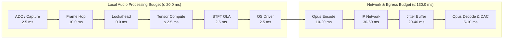
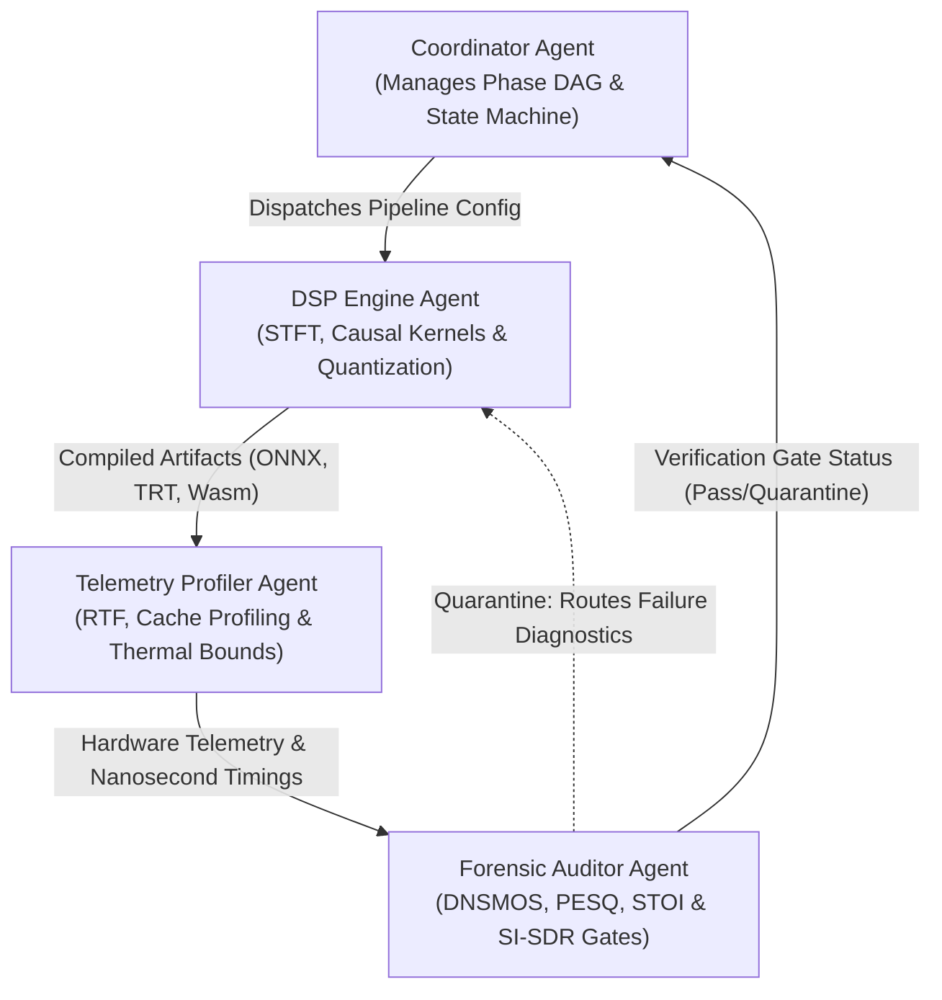

# 00: MISSION, MATHEMATICAL BOUNDS & ENGINEERING CONTRACTS

> **Document ID:** SPEC-ARCH-00-BOUNDS  
> **Status:** FROZEN  
> **Phase:** Phase 0 (Define the Mission)  
> **Target Framework:** Google Antigravity SDK & Edge AI Neural Audio Testbench

---

## 1. Mission Statement & North Star Objectives

The objective of the **Edge AI Neural Audio Denoiser & Profiler** project is to deliver a commercial and tactical-grade, low-power real-time speech enhancement and diagnostic testbench. The system operates with strict mathematical rigor, zero-copy memory safety, and sub-millisecond tensor compute to achieve parity with **NVIDIA Broadcast / RTX Voice**, while supporting heterogeneous edge devices:
* **NVIDIA Jetson Orin Nano / AGX Orin (7W–15W TDP)**
* **Apple Silicon (ANE & Metal Performance Shaders)**
* **Modern x86_64 Client CPUs (Intel VNNI `vpdpbusd` / AVX-512 / AVX2)**
* **In-Browser Web Audio (AudioWorklet) & WebGPU**

### Core Invariants
1. **Zero Marketing Illusion — Total Forensic Reality:** All latency benchmarks, memory allocations, and SNR/DNSMOS figures reflect genuine hardware execution counters.
2. **Strict Causality Invariant:** $\text{Lookahead} = 0.0\text{ ms}$. The pipeline never inspects or buffers future audio frames.
3. **L2 Cache Residency Invariant:** Quantized model weights must not exceed $2.5\text{ MB}$, guaranteeing 100% residency inside processor L2 cache and eliminating DRAM memory bandwidth bottlenecks.
4. **COLA Window Energy Invariant:** All analysis and synthesis filterbanks adhere to Constant Overlap-Add (COLA) energy preservation: $\sum_m w^2[n - mH] \equiv 1.0$.

---

## 2. Mathematical & Acoustic Bounds

The engine standardizes on two streaming profiles: **Wideband Voice (16 kHz)** and **Studio Fullband (48 kHz)**.

### 2.1 Acoustic Stream Parameters
* **Bit Depth:** 16-bit signed linear PCM, symmetrically scaled to float32 $[-1.0, +1.0]$ via $x[n] / 32767.0$.
* **Channel Format:** Monaural processing with phase-locked stereo / multi-channel beamforming expansion.
* **Lookahead ($T_{\text{lookahead}}$):** $0.0\text{ ms}$ (strict causality).

### 2.2 Short-Time Fourier Transform (STFT) Framing Matrix
| Dimension | Wideband Fast-Path | Studio Fullband | Mathematical Definition |
| :--- | :--- | :--- | :--- |
| **Sampling Rate ($f_s$)** | $16\,000\text{ Hz}$ | $48\,000\text{ Hz}$ | Nyquist limit: $f_{\text{Nyq}} = f_s / 2$. |
| **Window Length ($N$)** | $512\text{ samples}$ ($32.0\text{ ms}$) | $960\text{ samples}$ ($20.0\text{ ms}$) | STFT bin bandwidth $\Delta f = f_s / N$. |
| **Hop Size ($H$)** | $256\text{ samples}$ ($16.0\text{ ms}$) | $480\text{ samples}$ ($10.0\text{ ms}$) | Frame advance step (50% overlap). |
| **FFT Bins ($K$)** | $257\text{ bins}$ | $481\text{ bins}$ | $K = N/2 + 1$ (conjugate symmetric). |
| **Window Function** | Periodic Square-Root Hann | Periodic Square-Root Hann | $w[n] = \sin\left(\frac{\pi (n + 0.5)}{N}\right), \quad n \in [0, N-1]$. |
| **Overlap-Add (OLA)** | Dual-window symmetric | Dual-window symmetric | $\sum_{m=-\infty}^{\infty} w_a[n - mH] w_s[n - mH] = 1.0$. |

---

## 3. Telecommunication Latency SLAs (ITU-T G.114)

ITU-T G.114 mandates that one-way mouth-to-ear delay remain $\le 150.0\text{ ms}$ for transparent conversational flow.



### Real-Time Factor (RTF) Budget
$$\text{RTF} = \frac{T_{\text{compute}}}{T_{\text{hop}}} \le 0.25 \quad (\text{P50 target}), \quad \le 0.35 \quad (\text{P99 target})$$
* At $16\text{ kHz}$ ($H = 256$ samples, $T_{\text{hop}} = 16.0\text{ ms}$): $T_{\text{compute}} \le 4.0\text{ ms}$.
* At $48\text{ kHz}$ ($H = 480$ samples, $T_{\text{hop}} = 10.0\text{ ms}$): $T_{\text{compute}} \le 2.5\text{ ms}$.

---

## 4. Objective Quality & Intelligibility Gate Thresholds

Every pipeline release must satisfy 100% of the following verification assertions:

| Standard / Metric | Metric Description | Noisy Input | Required Minimum Release Target | Exceptional Parity Target |
| :--- | :--- | :--- | :--- | :--- |
| **ITU-T P.835 OVRL** | DNSMOS Overall Quality | $1.80 - 2.40$ | $\ge \mathbf{3.65}$ | $\ge 4.10$ |
| **ITU-T P.835 SIG** | Speech Distortion Rating | $3.20 - 3.80$ | $\ge \mathbf{4.05}$ | $\ge 4.35$ |
| **ITU-T P.835 BAK** | Background Noise Suppression | $1.20 - 1.90$ | $\ge \mathbf{4.00}$ ($\ge 28\text{ dB}$ atten.) | $\ge 4.50$ |
| **ITU-T P.862.2 WB-PESQ** | Wideband Perceptual Score | $1.60 - 2.10$ | $\ge \mathbf{3.15}$ ($\Delta \ge +0.90$) | $\ge 3.60$ |
| **STOI** | Speech Intelligibility Index | $0.72 - 0.85$ | $\ge \mathbf{0.92}$ | $\ge 0.96$ |
| **$\Delta\text{STOI}$** | Intelligibility Degradation Guard | $0.00$ | $\ge \mathbf{0.00}$ (Zero degradation) | $\ge +0.08$ |
| **$\Delta\text{SI-SDR}$** | Scale-Invariant SDR Gain | $0.0\text{ dB}$ | $\ge \mathbf{+8.50\text{ dB}}$ | $\ge +14.0\text{ dB}$ |
| **Broadband SNR Gain** | Static/Dynamic Noise Reduction | $0.0\text{ dB}$ | $\ge \mathbf{+10.0\text{ dB}}$ | $\ge +18.0\text{ dB}$ |

---

## 5. Hardware Target Envelopes

### 5.1 NVIDIA Jetson Orin Nano / AGX Orin
* **Thermal Design Power (TDP):** $7\text{W}$ (Eco mode) to $15\text{W}$ (Max-N mode).
* **Accelerators:** Ampere GPU (512–1024 CUDA Cores, 16–32 Tensor Cores).
* **Memory Bandwidth:** $68\text{ GB/s}$ unified LPDDR5.
* **Quantization Target:** TensorRT INT8 (Symmetric MinMax Calibration) with FP16 fallback.
* **Latency Budget:** $T_{\text{compute}} \le 1.8\text{ ms}$ per frame.

### 5.2 Apple Silicon (Apple Neural Engine & MPS)
* **Architecture:** 16-Core ANE (up to 38 TOPS on modern M-series), Unified Memory Architecture (UMA).
* **Graph Compilation:** CoreML model with strictly static tensor shapes (`[1, 1, 257, 1]`).
* **Zero-Copy Interop:** Direct binding to `IOSurface` and `CVPixelBuffer` via CoreAudio (zero CPU/GPU memcpy).
* **Latency Budget:** $T_{\text{compute}} \le 1.2\text{ ms}$ on ANE.

### 5.3 Modern x86_64 Client CPUs
* **SIMD ISA Extensions:** Intel AVX2, AVX-512, and DL Boost VNNI (`vpdpbusd`).
* **Integer Arithmetic:** 4-element 8-bit integer dot products accumulated into 32-bit integers in a single cycle.
* **Throughput:** Up to 128 INT8 MACs/cycle on dual FMA ports.
* **Latency Budget:** $T_{\text{compute}} \le 0.8\text{ ms}$ per frame.

### 5.4 In-Browser Web Audio & WebGPU
* **AudioWorklet Quantum:** Strictly $128\text{ samples}$ ($2.67\text{ ms}$ at $48\text{ kHz}$ / $8.0\text{ ms}$ at $16\text{ kHz}$).
* **Memory Invariant:** Zero heap allocations inside `AudioWorkletProcessor.process()` (no GC pauses).
* **Ring Buffer:** Lock-free Single-Producer Single-Consumer (SPSC) ring buffer backed by `SharedArrayBuffer` & `Atomics`.
* **Compute Engine:** Wasm SIMD128 for deterministic synchronous execution, WebGPU compute shaders for batch offline tasks.

---

## 6. Acoustic Noise Taxonomy (DNS Challenge Protocol)

The benchmark laboratory validates models across four distinct noise categories across SNRs from $-10\text{ dB}$ to $+20\text{ dB}$:

1. **Stationary Background Noise:**
   * HVAC blowers, white/pink Gaussian noise, drone rotors, server fans.
   * *Contract:* Noise attenuation $\ge 30\text{ dB}$, zero musical tone modulation.
2. **Non-Stationary & Transient Noise:**
   * Mechanical keyboard clicks, mouse clicks, dish clatter, door slams, siren sweeps.
   * *Contract:* Transient attack response $< 5.0\text{ ms}$, zero pre-echo chirping.
3. **Competing Speech & Babble:**
   * Café cocktail party noise (2 to 8 background speakers).
   * *Contract:* Preserve foreground target speaker; zero phoneme hallucination or cross-talk synthesis.
4. **RF Static & Channel Impairments:**
   * GSM TDMA $217\text{ Hz}$ frame buzzing, packet drops ($5\%-15\%$), microphone non-linear saturation.
   * *Contract:* Recurrent hidden state stability without divergence or numerical overflow.

---

## 7. Google Antigravity SDK Autonomous Swarm Architecture

The automated evaluation, continuous benchmarking, and release gate auditing are orchestrated by a 4-tier autonomous agent swarm:



### 7.1 Autonomous Gate Assertion Protocol
Any model artifact failing a single assertion below is automatically quarantined:

```python
def verify_release_contract(report: AudioEnhancementTelemetryReport) -> bool:
    # Latency & Causality Contracts
    assert report.dsp_parameters.lookahead_samples == 0, "Non-causal lookahead detected!"
    assert report.hardware_telemetry.rtf_p99 <= 0.35, "P99 RTF exceeds 0.35 threshold!"
    assert not report.hardware_telemetry.thermal_throttle_detected, "Thermal throttling triggered!"

    # Psychoacoustic Quality Contracts
    assert report.quality_metrics.dnsmos_ovrl >= 3.65, "DNSMOS OVRL < 3.65"
    assert report.quality_metrics.dnsmos_sig >= 4.05, "DNSMOS SIG < 4.05"
    assert report.quality_metrics.dnsmos_bak >= 4.00, "DNSMOS BAK < 4.00"
    assert report.quality_metrics.wb_pesq >= 3.15, "Wideband PESQ < 3.15"
    assert report.quality_metrics.delta_stoi >= 0.00, "STOI degraded below baseline noisy!"
    assert report.quality_metrics.delta_sisdr_db >= 8.50, "SI-SDR improvement < 8.5 dB"

    # Hardware Memory Contract
    assert report.model_metadata.binary_size_bytes <= 2_500_000, "Model exceeds 2.5 MB L2 cache limit!"
    return True
```

---

## 8. Specification Sign-Off & Traceability

* **Phase 0 Status:** SIGNED OFF & FROZEN
* **Next Phase:** Phase 1 (Deep Research + Competitive Landscape)
