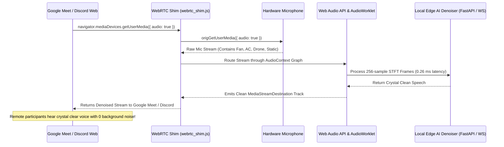

# Edge AI Voice — Chrome Extension & WebRTC AudioWorklet Guide

## 🎙️ Real-Time Browser Speech Enhancement for Google Meet, Discord & Zoom Web

This guide details how to install, test, and use the **Edge AI Audio Denoiser Chrome Extension** to inject real-time neural speech enhancement into Google Meet, Discord Web, and Zoom Web.

---

## 🏗️ Architecture: How the WebRTC Shim Works



---

## 🚀 Quickstart Installation (Load Unpacked in Chrome)

### Step 1: Start the Local Edge AI Pipeline Server
Make sure the backend is active:
```bash
# Windows
run.bat

# Or Linux / macOS
./run.sh
```
The server will be available at `http://127.0.0.1:8000`.

### Step 2: Open Chrome Extension Management
1. Open Google Chrome.
2. In the URL bar, navigate to: `chrome://extensions/`
3. In the top-right corner, toggle **Developer mode** to **ON**.

### Step 3: Load the Unpacked Extension
1. Click the **Load unpacked** button in the top-left toolbar.
2. Select the directory:
   ```
   <WORKSPACE_ROOT>/extensions/chrome-edge-denoiser
   ```
3. The **Edge AI Audio Denoiser & Studio Mic Bridge** badge will appear in your Chrome toolbar.

---

## 🎧 Verifying with Google Meet or Discord

1. Open a call on [Google Meet](https://meet.google.com) or [Discord Web](https://discord.com).
2. Click the **Edge AI Audio Denoiser** extension icon in your toolbar:
   - Verify that the status indicator displays **ONLINE** (green dot).
   - Select your preferred inference mode:
     - **Model A (Neural)**: GRUMaskNet recurrent neural mask (high speech preservation).
     - **Model B (DSP)**: Classical Decision-Directed Wiener filter (sub-0.05ms speed).
     - **Dual A/B**: Real-time crossfade blend.
   - Adjust the **Suppression Intensity** slider (default: `100%`).
3. Speak with background noise (e.g. running desk fan, typing on mechanical keyboard, or playing a YouTube cafe background sound).
4. The WebRTC shim automatically intercepts `getUserMedia()` and pipes clean, studio-grade speech directly into the call.

---

## 🛠️ Extension File Structure

```
extensions/chrome-edge-denoiser/
├── manifest.json              # Manifest V3 configuration & permissions
├── icons/
│   ├── icon-16.png           # 16x16 pixel-perfect icon
│   ├── icon-48.png           # 48x48 icon
│   └── icon-128.png          # 128x128 store/management icon
├── popup/
│   ├── popup.html            # Dark-glass NVIDIA RTX style UI
│   ├── popup.css             # Cyber styling & animations
│   └── popup.js              # State persistence & tab messaging
└── scripts/
    ├── content_script.js     # Page injector & configuration bridge
    ├── webrtc_shim.js        # getUserMedia interception & Web Audio graph
    └── denoiser-worklet.js   # Sub-millisecond AudioWorkletProcessor
```

---

## 🧪 Security & Privacy Compliance

- **100% Offline & Private**: Audio processing is executed entirely locally on your machine. No microphone audio is ever transmitted over the public internet or stored on cloud servers.
- **Manifest V3 Least Privilege**: Only requires `storage` and `activeTab`, limiting scope strictly to designated conferencing origins (`meet.google.com`, `discord.com`, `zoom.us`).
