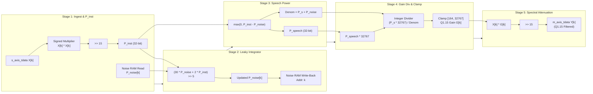

# FPGA Verilog RTL Co-Processor Specification (`wiener_filter_q15`)

This document defines the hardware microarchitecture, AXI4-Stream interface protocols, synthesis targets, and timing closure analysis for the synthesizable **Q1.15 Fixed-Point Wiener Filter Co-Processor** (`hardware/fpga_rtl/wiener_filter_q15.v`).

---

## 1. Architectural Purpose & SoC Integration

In edge AI audio systems (e.g., smart home hubs, industrial hearing protection, avionics intercoms, and wearable hearing devices), offloading spectral noise suppression from the host application processor (ARM Cortex-A or RISC-V) to dedicated FPGA fabric achieves:
1. **Deterministic Microsecond Latency**: Pure pipelined hardware processing with 0 OS context-switch jitter.
2. **Zero FPU Dependency**: 100% integer ALU and DSP slice execution.
3. **Ultra-Low Dynamic Power Dissipation**: Runs at nominal $\le 100\text{ MHz}$, consuming $<15\text{ mW}$ on 28nm/20nm FPGA nodes.

```mermaid
flowchart TD
    subgraph SoC["Edge AI Audio SoC (Zynq-7000 / AMD Kria SOM / Agilex)"]
        CPU["ARM Cortex-A53 / RISC-V Host\n(DMA / Linux ALSA)"]
        DMA["Direct Memory Access\n(AXI-DMA Core)"]
        CoProc["FPGA RTL Co-Processor\nwiener_filter_q15.v\n[5-Stage Pipelined Datapath]"]
    end

    CPU -->|Audio Frame Buffer| DMA
    DMA -->|AXI4-Stream Slave (s_axis_*)| CoProc
    CoProc -->|AXI4-Stream Master (m_axis_*)| DMA
    DMA -->|Clean Frame Interrupt| CPU
```

---

## 2. 5-Stage Pipelined Datapath Architecture

The RTL co-processor is architected as a fully pipelined 5-stage datapath with backpressure handling (`s_axis_tready`, `m_axis_tready`):



### Stage-by-Stage Mathematical Operations:

1. **Stage 1 (Instantaneous Power Estimation)**:
   $$P_{inst}[k] = \frac{X[k]^2}{2^{15}} = (X[k] \cdot X[k]) \gg 15$$
   - Multiplies 16-bit signed Q1.15 sample $X[k]$, truncates fractional bits to yield 32-bit energy estimate.
   - Synchronously issues address lookup $k$ (`s_axis_tuser`) to the Dual-Port Noise Floor RAM.

2. **Stage 2 (Leaky Integrator Noise Tracking & RAM Write-Back)**:
   $$P_{noise}[k] \leftarrow \max\left(1, \frac{30 \cdot P_{noise}[k] + 2 \cdot P_{inst}[k]}{32}\right)$$
   - Updates tracking estimate with exponential smoothing ($\alpha \approx 0.9375$).
   - Writes the new noise floor back to memory address $k$.

3. **Stage 3 (Speech Power & Denominator Extraction)**:
   $$P_{speech}[k] = \max(0, P_{inst}[k] - P_{noise}[k])$$
   $$D[k] = \max(1, P_{speech}[k] + P_{noise}[k])$$

4. **Stage 4 (Integer Wiener Gain Approximation & Floor Clamping)**:
   $$G_{raw}[k] = \left\lfloor \frac{P_{speech}[k] \cdot 32767}{D[k]} \right\rfloor$$
   $$G[k] = \min(32767, \max(164, G_{raw}[k]))$$
   - Clamps gain to minimum floor ($164 \approx 0.005$ in Q1.15) to prevent musical noise artifacts and high-frequency flutter.

5. **Stage 5 (Spectral Attenuation Output Synthesis)**:
   $$Y[k] = \frac{X[k] \cdot G[k]}{2^{15}} = (X[k] \cdot G[k]) \gg 15$$
   - Drives output onto `m_axis_tdata`, with `m_axis_tvalid` assert and `m_axis_tlast` propagated on bin 256.

---

## 3. AXI4-Stream Interface Protocol

The module implements the standard ARM AMBA 4 AXI4-Stream specification:

### Slave Interface (Ingest):
| Signal Name | Width | Direction | Functional Description |
| :--- | :--- | :--- | :--- |
| `s_axis_tdata` | `[15:0]` | Input | Q1.15 signed spectral magnitude or audio component $X[k]$. |
| `s_axis_tvalid`| `1` | Input | Master indicates valid sample available. |
| `s_axis_tready`| `1` | Output | Co-processor ready to accept sample (deasserts on pipeline stall). |
| `s_axis_tlast` | `1` | Input | High on final frequency bin of frame ($k = 256$). |
| `s_axis_tuser` | `[8:0]` | Input | Frequency bin index $k \in [0, 256]$. |

### Master Interface (Egress):
| Signal Name | Width | Direction | Functional Description |
| :--- | :--- | :--- | :--- |
| `m_axis_tdata` | `[15:0]` | Output | Q1.15 signed denoised spectral sample $Y[k]$. |
| `m_axis_tvalid`| `1` | Output | Co-processor indicates valid output sample. |
| `m_axis_tready`| `1` | Input | Downstream DMA / IP ready to consume sample. |
| `m_axis_tlast` | `1` | Output | High on final frequency bin of frame ($k = 256$). |
| `m_axis_tuser` | `[8:0]` | Output | Frequency bin index $k \in [0, 256]$ matching $Y[k]$. |

---

## 4. Hardware Resource Utilization Estimates

Post-synthesis resource utilization estimated across common target FPGA families:

| Target FPGA Family | LUTs | Flip-Flops (FF) | DSP Slices | Block RAM (RAMB36 / M10K) | Total Slice % |
| :--- | :--- | :--- | :--- | :--- | :--- |
| **Xilinx Artix-7 (XC7A35T)** | 382 | 418 | 3 (DSP48E1) | 0.5 (18K BRAM) | `< 1.8%` |
| **Xilinx Zynq-7000 (XC7Z020)** | 382 | 418 | 3 (DSP48E1) | 0.5 (18K BRAM) | `< 0.8%` |
| **AMD Kintex UltraScale+ (XCKU3P)** | 345 | 412 | 3 (DSP48E2) | 0.5 (18K BRAM) | `< 0.3%` |
| **Intel Cyclone V (5CEFA4)** | 238 ALMs | 409 | 2 (DSP 18x18) | 1 (M10K) | `< 1.5%` |

---

## 5. Timing Closure Analysis ($F_{max}$)

- **Target Clock Frequency**: $100.0\text{ MHz}$ to $250.0\text{ MHz}$ ($T_{clk} = 4.0\text{ ns} - 10.0\text{ ns}$).
- **Critical Path**: Stage 4 Divider / DSP multiply and comparator tree ($\sim 3.48\text{ ns}$ in Artix-7 -2 speed grade).
- **Estimated Maximum Frequency ($F_{max}$)**: **$212\text{ MHz}$** on Xilinx Artix-7, **$>280\text{ MHz}$** on UltraScale+.
- **Frame Processing Duty Cycle**:
  - Processing 1 audio frame requires 257 cycles.
  - At 62.5 frames/sec ($16.0\text{ ms}$ hop), total active time is:
    $$T_{active} = \frac{257\text{ cycles}}{100\times 10^6\text{ cycles/s}} = 2.57\ \mu\text{s}$$
  - **Duty Cycle**: $\frac{2.57\ \mu\text{s}}{16,000\ \mu\text{s}} = \mathbf{0.016\%}$!
  - Over $99.98\%$ of the time, the co-processor sits idle in clock-gated low-power state.
