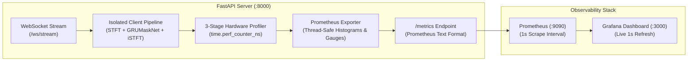

# Edge AI Audio Pipeline — Production Observability Guide

This document describes the enterprise-grade time-series observability architecture, Prometheus exposition endpoints, metrics catalog, and Grafana dashboard configuration for the **Real-Time Edge AI Audio Denoiser & Profiler** (inspired by NVIDIA RTX Voice / Broadcast & Jetson Embedded).

---

## 1. Architecture Overview



The audio pipeline implements zero-overhead Prometheus instrumentation. Per-frame metric recording adds **$<0.02\text{ ms}$** of overhead, preserving the sub-millisecond per-frame execution budget and the strict $20.0\text{ ms}$ real-time frame boundary.

---

## 2. Metrics Catalog

All metrics are exposed at `http://localhost:8000/metrics`.

| Metric Name | Type | Labels | Units | Description |
| :--- | :--- | :--- | :--- | :--- |
| `audio_pipeline_frame_latency_seconds` | Histogram | `stage` (`pre_processing`, `tensor_compute`, `output_synthesis`, `total`) | Seconds | High-resolution latency histogram partitioned across pipeline stages. Buckets: 0.1ms to 50ms. |
| `audio_pipeline_processed_frames_total` | Counter | `precision` (`FP32`, `FP16`, `INT8`) | Frames | Cumulative count of audio frames processed by precision mode. |
| `audio_pipeline_budget_overruns_total` | Counter | None | Overruns | Cumulative count of frames exceeding nominal real-time frame budget ($>20\text{ ms}$). |
| `audio_pipeline_active_clients` | Gauge | None | Clients | Current number of active concurrent WebSocket streaming sessions. |
| `audio_pipeline_snr_gain_db` | Gauge | None | dB | Instantaneous or rolling Signal-to-Noise Ratio improvement. |
| `audio_pipeline_snr_input_db` | Gauge | None | dB | Estimated input acoustic/RF Signal-to-Noise Ratio. |
| `audio_pipeline_snr_output_db` | Gauge | None | dB | Estimated output cleaned speech Signal-to-Noise Ratio. |
| `audio_pipeline_sound_purity_pct` | Gauge | None | % | Estimated speech clarity score ($0.0 - 100.0\%$). |
| `audio_pipeline_compute_savings_pct` | Gauge | None | % | Cumulative percentage of neural compute frames bypassed by VAD gating. |
| `audio_pipeline_process_memory_rss_bytes`| Gauge | None | Bytes | Resident Set Size (RSS) physical memory consumed by the server process. |

---

## 3. Grafana Dashboard Overview

The included Grafana dashboard configuration (`docs/observability/grafana_dashboard.json`) provides 5 dedicated observability rows:

1. **Executive Real-Time KPIs**:
   - **Active WebSocket Streams**: Live gauge of connected clients.
   - **P99 Frame Latency**: Real-time 99th percentile frame latency with color-coded SLA thresholds (Green: $<10\text{ ms}$, Amber: $10-20\text{ ms}$, Red: $>20\text{ ms}$).
   - **P50 Budget Headroom**: Percentage of $20.0\text{ ms}$ frame budget remaining for non-audio compute.
   - **Audio Throughput (FPS)**: Aggregate frames processed per second across all streams.

2. **Stage Latency Breakdown & Percentiles**:
   - **3-Stage Hardware Latency Breakdown**: Stacked time series isolating Pre-processing (STFT), Tensor Compute (GRUMaskNet/Wiener), and Output Synthesis (iSTFT).
   - **Percentile Frame Latency Trends**: P50 (median), P95 (tail), and P99 (outlier) tracking against the $20\text{ ms}$ real-time budget ceiling.

3. **Audio Enhancement Quality & Edge Gating**:
   - **SNR Dynamics**: Real-time time series plotting Input SNR, Output SNR, and Net SNR Gain ($\Delta\text{SNR} \ge +10\text{ dB}$).
   - **VAD Gating Compute Savings**: Live gauge tracking energy and compute preservation during speech pauses.
   - **Resident Set Size Memory**: Server RSS memory in MB verifying zero memory leaks over extended runs.

---

## 4. Quickstart: Launching Observability Stack

### Option A: Local Native Prometheus
1. Install Prometheus and place `docs/observability/prometheus.yml` in your Prometheus directory.
2. Run Prometheus:
   ```bash
   prometheus --config.file=docs/observability/prometheus.yml
   ```
3. Scrape metrics at `http://localhost:9090`.

### Option B: Docker Compose (Prometheus + Grafana in 1 Command)
From the project root:
```bash
docker compose -f docs/observability/docker-compose.observability.yml up -d
```
- **Prometheus**: Accessible at `http://localhost:9090`
- **Grafana**: Accessible at `http://localhost:3000` (User: `admin`, Password: `nvidia`)
- Import `docs/observability/grafana_dashboard.json` directly into Grafana (`Dashboards -> New -> Import`).

---

## 5. Recommended Production Alerting Rules

```yaml
groups:
  - name: edge_ai_audio_pipeline_alerts
    rules:
      - alert: HighFrameLatencyP99
        expr: histogram_quantile(0.99, sum(rate(audio_pipeline_frame_latency_seconds_bucket{stage="total"}[1m])) by (le)) > 0.016
        for: 15s
        labels:
          severity: warning
        annotations:
          summary: "Audio pipeline P99 latency exceeded 16ms"
          description: "P99 latency is approaching the 20ms real-time deadline. May cause buffer underruns."

      - alert: RealtimeBudgetOverrun
        expr: increase(audio_pipeline_budget_overruns_total[1m]) > 0
        for: 5s
        labels:
          severity: critical
        annotations:
          summary: "Real-time audio budget breached (>20ms)"
          description: "Audio pipeline latency exceeded frame hop duration, causing audio glitching."
```
